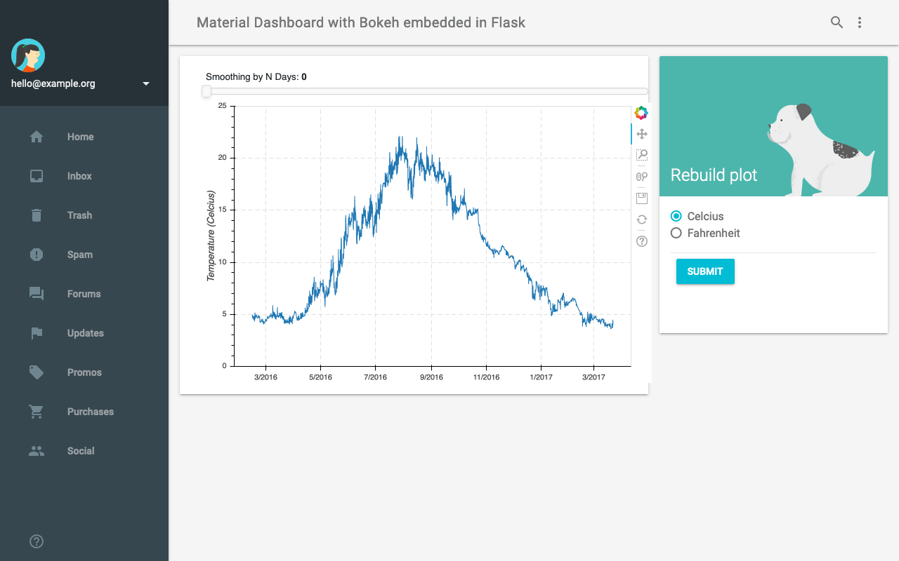

===============================================
Material Dashboard with Bokeh embedded in Flask
===============================================

|Contributors| |License|

.. |Contributors| image:: https://img.shields.io/github/contributors/veit/flask-bokeh-dashboard.svg
   :target: https://github.com/veit/flask-bokeh-dashboard/graphs/contributors
.. |License| image:: https://img.shields.io/github/license/veit/flask-bokeh-dashboard.svg
   :target: https://github.com/veit/flask-bokeh-dashboard/blob/master/LICENSE

Features
========

The package provides a starter pack with an interactive `Bokeh
<https://bokeh.pydata.org>`_ plot embedded in a `Material Design
<https://material.io/>`_ Dashboard, which can send parameters from a flask form
to Bokeh.

.. note::
   Please keep in mind that this is only a lightweight example of how Flask can
   affect the rendering of the bokeh plot. The change in scale is out of scope.

Quickstart
==========

Before you install Python packages, you must meet a few requirements.

#. Make sure you use the desired Python version:

   .. code-block:: console

    $ python --version
    Python 3.7.3

    Only Python >=3.6 is supported.

#. Make sure that `Pip
   <https://jupyter-tutorial.readthedocs.io/de/latest/reproduce/packaging/glossary.html#term-pip>`_
   is installed:

   .. code-block:: console

    $ pip --version
    pip 18.1

#. If Pip isn’t installed, you can install it with:

   .. code-block:: console

    $ sudo apt install python3-venv python3-pip

#. Install `Pipenv <https://docs.pipenv.org>`_:

   .. code-block:: console

    $ pip3 install --user pipenv
      Downloading pipenv-2018.7.1-py3-none-any.whl (5.0MB): 5.0MB downloaded
    Requirement already satisfied (use --upgrade to upgrade): virtualenv in /usr/lib/python3/dist-packages (from pipenv)
    Installing collected packages: pipenv, certifi, pip, setuptools, virtualenv-clone
    …
    Successfully installed pipenv certifi pip setuptools virtualenv-clone
    Cleaning up...

#. Download:

   .. code-block:: console

    $ curl -O https://github.com/veit/flask-bokeh-dashboard/archive/master.zip
    $ unzip master.zip

#. Create virtual environment:

   .. code-block:: console

    $ cd flask-bokeh-dashboard
    $ pipenv install
    Creating a virtualenv for this project…
    …
    Updated Pipfile.lock 

    Installing dependencies from Pipfile.lock Updated Pipfile.lock (f042ee)…
    …

#. Run the dashboard with the `gunicorn
   <http://docs.gunicorn.org/en/stable/run.html>`_ command:

   .. code-block:: console

    $ pipenv run gunicorn -w 1 main:app
    [2021-09-08 10:10:16 +0200] [55490] [INFO] Starting gunicorn 20.1.0
    [2021-09-08 10:10:16 +0200] [55490] [INFO] Listening at: http://127.0.0.1:8000 (55490)
    [2021-09-08 10:10:16 +0200] [55490] [INFO] Using worker: sync
    [2021-09-08 10:10:16 +0200] [55498] [INFO] Booting worker with pid: 55498

   .. note::
      The ``w`` option can be used to specify the number of workers.

#. Visit http://127.0.0.1:8000 and it should look like the screenshot above.

#. You can shut down the service in the console with ``ctrl-c``.

Pull requests
=============

If you have differences in your preferred setup, I encourage you to fork this
to create your own version. I also accept pull requests on this, if they are
small, atomic, and if they make my own packaging experience better.
